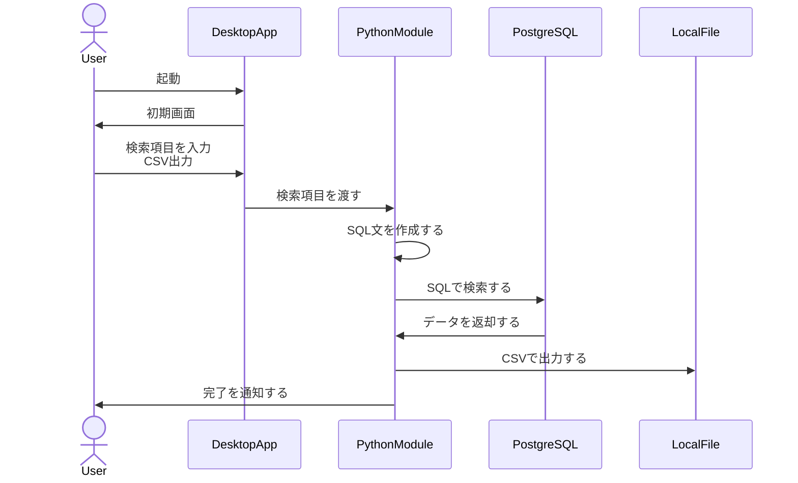

# JRA-VAN データ収集アプリ

1. [1. 技術](#1-技術)
   1. [1.1. 外部ツール](#11-外部ツール)
2. [2. UI](#2-ui)
3. [3. 設計](#3-設計)
   1. [3.1. データ収集](#31-データ収集)

## 1. 技術

* 言語
  * Python
* デスクトップフレームワーク
  * Flet
  * Flet-desktop
* データベース
  * PostgreSQL

### 1.1. 外部ツール

* JRA-VAN DataLab
  * PCKEIBA

## 2. UI

## 3. 設計

### 3.1. データ収集

